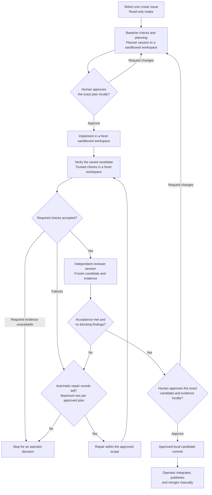

# Local Factory

A small TypeScript supervisor for human-approved software work. Pi agents work
in disposable copies of the repository, with every command confined by an
OS-level sandbox; the original checkout stays untouched. The output is a local
candidate commit with check and review evidence for manual integration. Linear
remains read-only.

Run `/factory-init` from a Pi session inside the target repository and the
factory registers it: detects its verification gate, proves the sandbox, runs
the checks once, and starts the supervisor. Herdr is optional. See
[the specification](docs/specification.md) and the
[compatibility record](docs/compatibility.md) for what is verified.

## Process flow



Agents can pause for a human answer during planning, implementation, repair,
or review. Answers and steering use the local commands or optional Telegram;
both approval gates stay local. Every changed candidate repeats verification
and review. Pause or interruption leaves work stopped until an explicit resume;
cancelled runs cannot resume.

## Bring-up

Use an Apple Silicon Mac with Node **26.5.x** (`.node-version` pins 26.5.0),
npm, Python 3, Git/Xcode Command Line Tools, and a Pi sign-in (`pi`, then
`/login`). Install once:

```sh
make setup      # pinned tools, build, and a sandbox proof on this host
make install    # /factory-init and /factory in every Pi session; factory on PATH
```

Then, inside any Git repository you want the factory to work on:

```text
pi
/factory-init
```

`/factory-init` asks for the Linear team and organization the first time (or
reads them from the existing configuration), detects the repository's own
verification gate (`go build`/`go vet`/`go test -race` for a Go module, the
`build`/`typecheck`/`lint`/`test` scripts of a `package.json`, `cargo
build`/`cargo test`, `pytest`, or a Makefile `verify`/`check`/`test` target),
registers the dependency download under an explicit registry allowlist,
writes `factory.local.json` in this installation, proves the sandbox, runs
the checks once against the current branch, and starts the supervisor in the
background. The same thing from a shell is `factory init [path] --org <key>
--team <TEAM>`; `--model provider/model-id` overrides the model detected from
the Pi sign-in. Review `factory.local.json` afterwards: the detected checks
are a starting point, not a judgement.

Linear sign-in is separate and interactive: `.cache/tools/linear-tui auth
login`. Until then `/factory-init` reports it as the next step; everything
else works. Disable linear-tui's control channel in its user configuration
with `[agent] control = false`; `context --json` reads view snapshots
independently. Use one active Linear account. Issue reads reject another
organization/team.

## How execution is confined

Each stage (planning, implementation, verification, review) gets a fresh
workspace under `.factory/work/`: the base commit or saved candidate written
from validated bytes, with its own small Git repository and no host Git
metadata. Every model command and every registered check runs through
[Anthropic's sandbox-runtime](https://github.com/anthropic-experimental/sandbox-runtime)
(`sandbox-exec` Seatbelt profiles on macOS, bubblewrap on Linux):

- writes are confined to that workspace and the factory cache
  (`.factory/cache`, for Go/npm/cargo caches via `${FACTORY_CACHE}`);
- reads of `~/.ssh`, `~/.aws`, `~/.pi`, `~/.config`, keychains, the factory
  state directory and the operator's live checkout are denied, so a `.env`
  in the real repository is never visible to a model;
- all network beyond the loopback interface is denied, except the registry
  hosts named by `environment.dependencies.allowHosts` while that one
  preparation command runs; loopback stays usable so test suites can start
  local listeners and integration tests can probe a local dev stack;
- during verification and review the workspace source is frozen: the sandbox
  refuses writes to it independently of permission bits, while registered
  dependency directories stay writable for tool caches.

The model never receives Pi's built-in host tools. Its tools are factory-owned:
`read_file`, `list_files`, `search_files` and (implementer only) `write_file`
are path-confined to the workspace copy; `exec` (implementer) and `run_check`
(reviewer, registered checks only) run inside the sandbox. Tools come from
the host PATH, so the toolchain a check needs must be installed on this Mac.
`environment.env` supplies explicit values, never inherited host secrets.
Registered checks must clean generated source files, because verification
rejects a changed source tree. Tracked symlinks and Git submodules are
unsupported. A failed sandbox stops the stage; there is no unsandboxed
fallback.

This is a process-level boundary, not a virtual machine: a kernel or sandbox
escape, or a tool that the host must trust anyway, is outside it. `setup` and
`init` refuse to proceed when a probe can write outside the workspace, read a
credential, or reach the network.

## Operating the factory

`make up` (or `factory up`) starts the supervisor detached, logging to
`.factory/supervisor.log`; repeating it reuses the running one. Inside a
Herdr pane the same command opens the full owned workspace instead
(supervisor, linear-tui and a locked-down operator Pi pane). `make down`
stops the supervisor, confirms recorded workspaces are gone, and preserves
saved runs, questions, candidates and logs in the private `.factory/`
directory. Changes to configuration require `down` then `up`; the running
supervisor rejects new work or continuation against changed settings.

`make validate` proves the registered profile before any issue exists: it
snapshots the base commit, prepares dependencies in a fresh sandboxed
workspace, runs every registered check with egress denied, and confirms the
checks leave tracked source unchanged. Private evidence lands in
`.factory/validation/<repository>-<uuid>.json`; it is not run evidence. A
required check that fails here fails every run's baseline too, so fix the
repository (or register an explicit `acceptBaselineFailure`) first.

[factory.migratory.example.json](factory.migratory.example.json) and
[factory.salesbook.example.json](factory.salesbook.example.json) are the
profiles `factory init` produces for those repositories, kept as references.
Issue intake rejects identifiers outside the configured `linear.team`
(`NEV` for both profiles); `doctor` does not check the key itself.

Create or select a Linear issue describing the change and acceptance criteria,
then `/factory plan ENG-42` (or `plan current` when linear-tui shows it).
Ordinary chat text does not start a task; explicit factory commands bind
approvals and execution to an issue. State stays in the factory installation;
model work uses snapshots of the registered repository.

## Working on an issue

Use `/factory` commands from any Pi session with the extension installed (or the operator pane inside Herdr), or the equivalent `factory` CLI:

```text
/factory plan current
/factory plan ENG-42
/factory status
/factory approve F-0123456789ab --plan <displayed-plan-hash>
/factory answer F-0123456789ab --request Q-0123456789ab --message <answer>
/factory steer F-0123456789ab --message <instruction-within-approved-scope>
/factory pause F-0123456789ab
/factory resume F-0123456789ab
/factory revise F-0123456789ab --message <requested-changes>
/factory approve F-0123456789ab --candidate <displayed-evidence-hash>
/factory cancel F-0123456789ab
```

Outside Pi: `factory status`, for example. `status` renders stored
plans, scope, baseline/check results, review, hashes, requests, logs and the
actual diff (up to 64 KB, with its full local path). Candidate approval uses
the **evidence hash** displayed as `candidate.evidenceHash`; the separate
`candidate.hash` identifies source bytes. Changed source discards all checks
and review. Requested changes go through planning and approval again.

After approval, status shows the private candidate repository and commit with
a quoted `git fetch` command. Inspect `git show FETCH_HEAD`, select your intended
destination branch, and integrate manually (for example, `git cherry-pick FETCH_HEAD`).
Check the destination before integrating and publish/merge yourself.

No model tool can approve, publish, merge, contact Linear, or execute
unsandboxed host commands. Slash commands are not model tools: a model in your
own Pi session cannot submit an approval. The Herdr operator profile goes
further and disables model requests, filesystem tools, MCP/discovered
extensions, and `!` host shell execution. Use `/factory steer` or a recorded answer to communicate
with an executing agent.

All free-form instructions retain the current path scope, checks,
network policy, and limits. Expanded authority requires `revise` and a new
plan approval. A steering instruction alone cannot change those controls.

For a Pi subscription, use an explicit host credential file:

```json
"model": {
  "provider": "openai-codex",
  "id": "gpt-5.5",
  "authFile": "/absolute/path/to/.pi/agent/auth.json",
  "maxOutputTokens": 8192
},
"budgetUsd": null
```

Sign in through Pi `/login` first. The file must have mode `0600`; Pi handles
locked OAuth refresh. Only credentials are read from this path; user settings,
extensions and executable model configuration are not loaded. `budgetUsd: null`
disables the factory's dollar cap and API-price reservations. Turn, output,
command and stage limits still apply, as do the subscription's own usage limits.
The default total active execution allowance is two hours (`limits.activeSeconds`).
Waiting for a human answer consumes neither stage nor total active time.
Catalog cost metadata is an API-equivalent estimate, not a subscription bill.
An API key can instead use `apiKeyEnv` in place of `authFile`.

A numeric dollar budget uses pinned Pi catalog prices. Before each model
request, the supervisor reserves the maximum input/context and configured
output cost, including pricing tiers. Reservations are not refunded, so the
reported reserved spend is deliberately conservative; actual usage is also
recorded. Choose a cap that covers your selected model's context size and the
number of turns needed. Unknown pricing refuses execution.

Linear scope can use a `team`, an exact `project`, or both. A project is configured
as `{ "name": "Salesbook", "url": "https://linear.app/neverzero/project/salesbook-fd9671bd1086/overview" }`.
The adapter resolves its UUID using read-only `project show --json`, validates
the returned URL, and rejects issues whose project UUID differs.

Checks are required by default. Mark an advisory check with `"required": false`;
its result remains visible. At least one required verification method is needed,
including an explicit alternative when the repository has no test suite.
Required unavailable checks always block a run. Shell exit codes 126/127 are
reported as unavailable commands rather than test failures.
Checks run on this host. Set `"platform": "linux-x64"` (or another supported
value) to record a requirement for a different platform; a check whose platform
is not this host is reported as unavailable without executing its argv.
`make doctor` rejects required checks for unsupported platforms. A baseline
failure exception cannot waive unavailable evidence.
If workspace execution is lost, remaining checks are explicitly recorded as skipped;
completed results and private logs survive the interruption. Each result records
its working directory, runner and environment identity as well as source and argv.

A known preexisting failure can have an explicit acceptance policy in the
trusted check profile:

```json
"acceptBaselineFailure": {
  "reason": "Known unrelated defect; preserve its exact exit code and output."
}
```

This policy and the failed baseline are included in the exact plan approval.
The candidate must either pass that check or match the baseline's nonzero exit
code and output hash exactly. A matched failure stays reported as failed, with
`comparison: "preexisting"`; independent review still checks every approved
acceptance criterion. A changed failure remains blocking. The factory keeps
one recent baseline keyed by base/source, environment, check profile, runner,
limits and build, and verifies its private log hashes before reuse. Unavailable
baseline evidence is retried rather than cached for reuse.

## Optional Telegram

Create a dedicated bot using [BotFather](https://core.telegram.org/bots/features#botfather)
and start a private conversation with it yourself. Add this section to
`factory.local.json` only when you want messaging enabled:

```json
"telegram": {
  "tokenEnv": "FACTORY_TELEGRAM_TOKEN",
  "userId": 123456789,
  "chatId": 123456789
}
```

Supply the named token using your credential manager. The supervisor checks
bot authentication, absence of a webhook, and the configured private chat
before reporting readiness. It then polls the official
[Bot API](https://core.telegram.org/bots/api#getupdates) in process.

The bot supports `/answer RUN REQUEST text`, `/steer RUN text`,
`/changes RUN HASH comments`, `/status RUN`, and `/pause RUN`. Replies to
recorded question/review messages supply their context automatically. A pause
button also binds its recorded context. Numeric user/chat IDs, current
references, and processed update IDs are checked; usernames never authorize
an action. Approvals, resume, publication, and merge stay local.

Notifications are best effort. An uncertain send does not resolve a question
and is not replayed automatically. Use `/factory resend RUN --request REQUEST`
(or `resend RUN` at an approval gate) to retry explicitly. Pending requests and
accepted replies remain in SQLite. Telegram outages do not stop local commands.
Bot chats are cloud chats, without end-to-end encryption; full diffs stay local.
Live bot creation, authentication and messaging have not been performed here.

## Recovery and verification

Interruptions stop work. On restart, unfinished stages become interrupted,
processes recorded in old workspaces are stopped and the workspaces deleted,
and nothing resumes automatically.
Answer a saved pending question, then explicitly resume. Paused and cancelled
runs retain their state. Resumption uses a fresh workspace from the last completely
exported candidate. Unexported work is lost. Material task/base/configuration
changes, or a changed factory build, require explicit revision/reapproval.

```sh
make help
make check          # type checking, durable gates, real sandbox/Pi boundary, fixture
make validate       # registered checks on the base commit in a fresh workspace; no model
factory cleanup     # remove unreferenced source artifacts while idle
```

Tests use temporary Git repositories, private factory roots and real sandboxed
workspaces. The fixture's scripted roles do not establish model quality or live
account compatibility. The Herdr workspace test runs only inside a Herdr pane.
See [compatibility findings](docs/compatibility.md) for verified versions,
remaining checks, and implementation limits.
The [acceptance record](docs/acceptance.md) maps the specification's required
scenarios to their current evidence and identifies outstanding live validation.
